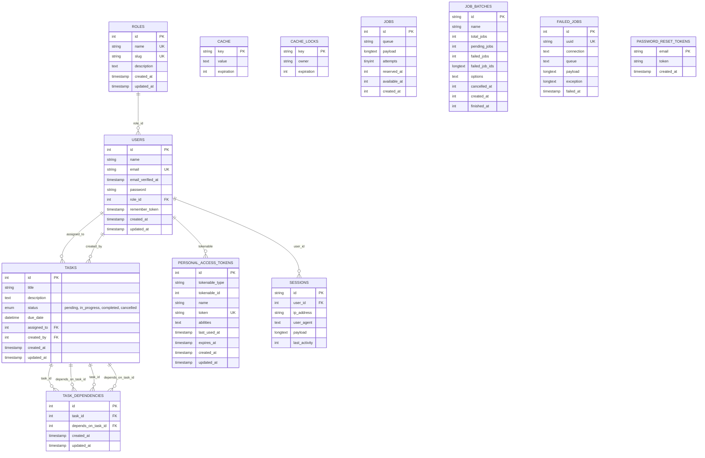

# Entity Relationship Diagram (ERD)

## Task Management System Database Schema

## Table Descriptions

### Users Table
- **Primary Key**: `id`
- **Unique Fields**: `email`
- **Foreign Keys**: `role_id` → Roles.id
- **Relationships**: 
  - Many-to-One with Roles
  - One-to-Many with Tasks (assigned_to, created_by)
  - One-to-Many with Personal Access Tokens
  - One-to-Many with Sessions

### Roles Table
- **Primary Key**: `id`
- **Unique Fields**: `name`, `slug`
- **Fields**: `name`, `slug`, `description`
- **Relationships**:
  - One-to-Many with Users

### Tasks Table
- **Primary Key**: `id`
- **Status Field**: `enum('pending', 'in_progress', 'completed', 'cancelled')`
- **Foreign Keys**: 
  - `assigned_to` → Users.id (nullable)
  - `created_by` → Users.id (required)
- **Relationships**:
  - Many-to-One with Users (assignee and creator)
  - One-to-Many with Task Dependencies (both as task and dependency)

### Task Dependencies Table
- **Primary Key**: `id`
- **Foreign Keys**:
  - `task_id` → Tasks.id
  - `depends_on_task_id` → Tasks.id
- **Constraints**:
  - Unique constraint on (task_id, depends_on_task_id)
  - Self-dependency prevention (task_id ≠ depends_on_task_id)
- **Relationships**:
  - Many-to-One with Tasks (task)
  - Many-to-One with Tasks (depends_on_task)

### Personal Access Tokens Table
- **Primary Key**: `id`
- **Unique Fields**: `token`
- **Polymorphic Relationship**: `tokenable_type` and `tokenable_id`
- **Purpose**: Laravel Sanctum authentication tokens

## Business Rules

1. **User Roles**:
   - Managers can create, update, and delete tasks
   - Managers can assign tasks to any user
   - Users can only view tasks assigned to them
   - Users can only update the status of tasks assigned to them

2. **Task Dependencies**:
   - A task cannot depend on itself (circular dependency prevention)
   - A task cannot be completed until all its dependencies are completed
   - Dependencies can only be managed by managers

3. **Task Status Flow**:
   - Tasks start as 'pending'
   - Can be moved to 'in_progress' or 'cancelled'
   - Can only be 'completed' if all dependencies are completed
   - Once 'completed' or 'cancelled', status changes are restricted

4. **Authentication**:
   - Uses Laravel Sanctum for stateless API authentication
   - Tokens are stored in personal_access_tokens table
   - Each user can have multiple tokens

## Indexes and Performance

- **Primary Keys**: All tables have auto-incrementing integer primary keys
- **Unique Indexes**: 
  - Users.email
  - Personal Access Tokens.token
  - Task Dependencies (task_id, depends_on_task_id)
- **Foreign Key Indexes**: All foreign key columns are indexed for performance
- **Composite Indexes**: Task Dependencies unique constraint prevents duplicate dependencies
